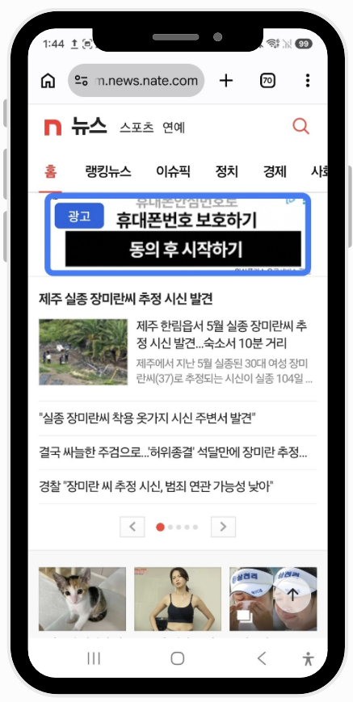
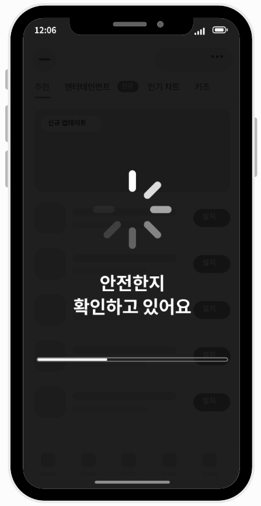
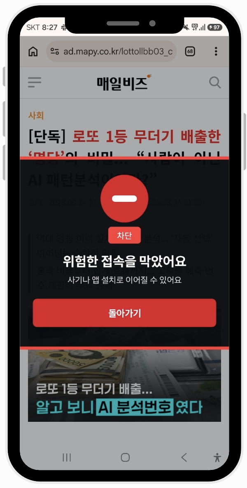
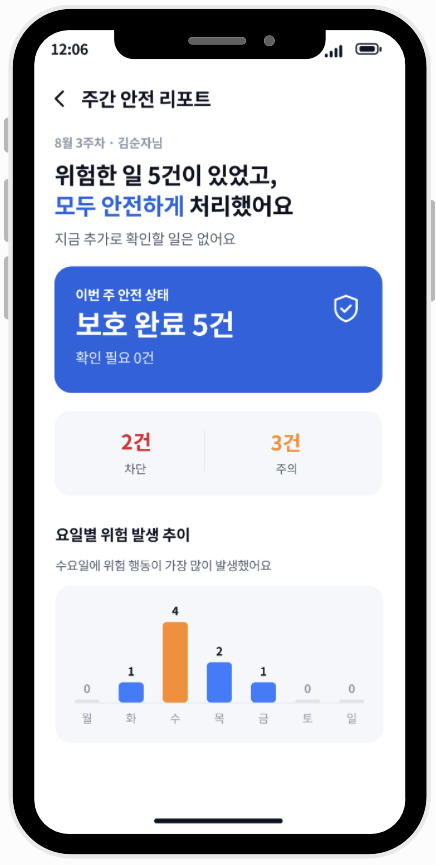

## GuADian

GuADian은 광고로 인한 피해가 시니어의 **모바일 사용 위축과 디지털 단절**로 이어지지 않도록, 광고는 **알아보기 쉽게 표시**하고 위험한 이동은 **진입 전에 막아 주는** 광고 안심 서비스입니다.

모바일 광고는 콘텐츠와 자연스럽게 섞여 광고임을 구분하기 어렵고, 작은 터치 하나만으로도 사칭 페이지, 악성 앱 설치, 민감정보 입력 화면으로 이어질 수 있습니다. GuADian은 광고를 무작정 삭제하지 않고 화면 위에 광고 영역을 테두리로 표시해, 사용자가 지금 보고 있는 정보가 광고인지 명확히 구분할 수 있도록 돕습니다.

① 위험도가 낮은 광고는 이용 흐름을 방해하지 않고 통과시키고, ② 주의가 필요한 광고는 한 번 더 확인하게 하며, ③ 명확한 위험은 진입 전에 차단합니다. 이를 통해 시니어에게는 **안전한 선택권**을, 보호자에게는 **필요한 수준의 대응 정보**를, 정상적인 광고주에게는 **광고를 무조건 배제하지 않는 신뢰 기반 접점**을 제공합니다.


이 문서는 앱 「GuADian」의 문제 정의, 핵심 기능, 위험 등급 체계, 시스템 구조, 실행 방법을 정리합니다.

- 기능 명세 [[spec.md]](docs/spec.md)
- 판정 기준 [[judge.md]](docs/judge.md)
- 위험 등급 근거 [[risk-grade-rationale.md]](docs/risk-grade-rationale.md)
- 검증 지표 [[risk-grade-validation.md]](docs/risk-grade-validation.md)

---

### Table of Contents

1. [01. 문제와 접근](#01-문제와-접근)
2. [02. 보호 흐름](#02-보호-흐름)
3. [03. 주요 기능](#03-주요-기능)
4. [04. 위험 등급 체계](#04-위험-등급-체계)
5. [05. 시스템 아키텍처](#05-시스템-아키텍처)
6. [06. 기술 스택](#06-기술-스택)
7. [07. 빠른 시작](#07-빠른-시작)
8. [08. API](#08-api)
9. [09. 검증](#09-검증)
10. [10. 기대 효과](#10-기대-효과)
11. [11. 비즈니스 모델](#11-비즈니스-모델)

---

### 01. 문제와 접근

모바일 광고 피해는 한 번의 잘못된 클릭으로 발생한 단순한 피해에서 끝나지 않습니다. 시니어가 광고와 콘텐츠를 구분하지 못한 채 사칭 페이지, 악성 앱 설치, 민감정보 입력 화면으로 이동하면 이후 모바일 서비스 이용을 피하거나 보호자에게 의존하게 될 수 있습니다. GuADian이 해결하려는 핵심 문제는 이런 광고 오인과 위험 이동이 모바일 사용 위축과 디지털 단절로 이어지는 것입니다.

GuADian은 이 문제를 광고 차단이 아니라 광고 안심의 관점에서 다룹니다. 광고를 모두 없애는 대신, 광고임을 먼저 구분하게 하고 위험한 이동만 선별해 막습니다. 그래서 정상 광고와 정상 이용 흐름은 유지하면서도, 피해로 이어질 수 있는 순간에는 사용자를 멈춰 세웁니다.

#### 기존 대응의 빈자리

| 기존 대응 | 보호 방식 | 남는 문제 |
| :-- | :-- | :-- |
| AdGuard | DNS, VPN, 필터 목록 기반 광고·추적 차단 | 광고를 줄이는 데 초점이 있어 위험한 광고를 설명하거나 사용자 선택 흐름을 만들기 어려움 |
| Brave | 브라우저 안의 광고·추적기 차단 | 인앱 브라우저, 다른 브라우저, 외부 앱으로 이어지는 광고 이동까지 포괄하기 어려움 |
| 전화·문자 스팸 차단 | 번호와 문자 패턴 차단 | 화면 속 광고와 광고 클릭 이후 이동은 보호 범위 밖에 있음 |
| 세이프 브라우징 | 알려진 악성 URL 차단 | 새로 생긴 광고 랜딩, 앱 전환, 보호자 전달 흐름에는 한계가 있음 |
| 자녀 보호 앱 | 앱 사용 제한과 차단 | 사용 제한 중심이라 시니어의 광고 오인과 가족 대응 맥락에 맞지 않음 |

---

### 02. 보호 흐름

GuADian의 보호 흐름은 광고를 알아보는 단계에서 시작해, 위험도를 판단하고, 필요한 수준만큼 개입한 뒤, 보호 결과를 남기는 구조입니다.

1. 광고 감지
   화면 속 광고 영역을 표시해 사용자가 콘텐츠와 광고를 구분할 수 있게 합니다.

2. 광고 판별
   광고가 이동시키는 도착지를 확인해 정상 광고와 위험 가능성이 있는 광고를 구분합니다.

3. 광고 개입
   `LOW`는 통과시키고, `MEDIUM`은 한 번 더 확인하게 하며, `HIGH`는 진입 전에 차단합니다.

4. 보호 결과
   대응이 필요한 사건만 기록하고 보호자에게 전달해 가족 대응은 가능하게 하되 과도한 감시는 줄입니다.

#### 화면 예시

| 광고 감지 | 광고 판별 | 광고 개입 | 보호 결과 |
| :-: | :-: | :-: | :-: |
| 클릭 전 | 클릭 중 | 클릭 후 | 사용자·보호자 |
|  |  |  |  |

---

### 03. 주요 기능

주요 기능은 광고를 접하는 순간부터 위험 이동이 발생한 뒤까지, 사용자가 실제로 불편함과 위험을 크게 느끼는 장면을 기준으로 정리합니다.

| 기능 | 연결되는 흐름 | 필요한 이유 | 기대 효과 |
| :-- | :-- | :-- | :-- |
| ① 광고 한 번에 닫기 | 광고 감지 | 여러 광고가 화면을 덮으면 본문이 잘 보이지 않고, 작은 닫기 버튼을 반복해서 찾는 과정이 피로함 | 광고를 빠르게 정리해 화면을 깨끗하게 보고 원래 콘텐츠에 집중할 수 있음 |
| ② 투터치 확인 | 광고 개입 | 의도치 않은 광고 터치가 바로 이동으로 이어지면 사용자는 원치 않는 화면 전환을 겪게 됨 | 한 번 더 확인하는 과정을 두어 실수 이동을 줄이고 사용자의 선택권을 남김 |
| ③ 쿠팡 등 외부 앱 강제 이동 감지 | 광고 개입 | 광고를 누른 뒤 쿠팡 같은 외부 앱으로 갑자기 전환되면 사용 흐름이 끊기고 불쾌감이 커짐 | 예기치 않은 앱 전환을 되돌려 사용자가 보던 화면 흐름을 유지함 |
| ④ APK 다운로드·설치 차단 | 광고 개입 | 광고가 공식 스토어 밖 설치 파일로 이어지면 사용자는 안전한 설치인지 판단하기 어려움 | 위험한 설치 진입을 막아 악성 앱, 원격제어, 개인정보 탈취 가능성을 낮춤 |
| ⑤ 검색 결과 보호 확장 | 광고 감지 확장 | 검색 결과에서도 공식 사이트처럼 보이는 광고나 출처가 불명확한 페이지를 자연스럽게 누를 수 있음 | 광고 화면 밖의 진입 단계에서도 위험 사이트 접근을 줄임 |
| ⑥ 보호자 연계 | 보호 결과 | 위험 상황이 지나간 뒤에는 어떤 광고를 눌렀고 무엇이 문제였는지 설명하기 어려움 | 필요한 사건만 정리해 보호자가 빠르게 확인하고 대응할 수 있게 함 |

---

### 04. 위험 등급 체계

[02. 보호 흐름](#02-보호-흐름)의 `통과 → 재확인 → 차단`은 위험 등급 체계로 결정됩니다. 위험 신호는 법령, 정부기관 안내, 플랫폼 정책에서 가져오고, 개입 수준의 구조는 W3C WSC-UI의 `Warning/Caution`과 `Danger` 구분을 참고합니다.

GuADian이 직접 설계한 부분은 이 공식 근거들을 실제 광고 도착지에 어떤 등급으로 배정할지에 대한 기준입니다. 즉, 등급 체계는 공식 기준에 기대고, 배정 기준은 GuADian의 서비스 맥락에 맞춘 적용 기준입니다.

위험 등급 체계에서 가장 중요한 것은 세 가지입니다.

① 근거 출처: 법령, 정부기관 안내, 플랫폼 정책에서 사칭, 민감정보 요구, APK 설치 같은 위험 신호를 가져옵니다.
② 등급 체계: W3C WSC-UI의 경고 수준 구분을 참고해 `LOW`, `MEDIUM`, `HIGH`, `UNKNOWN` 개입 수준을 구성합니다.
③ 배정 기준: 공식 출처가 제시한 위험 신호를 GuADian 안에서 어느 등급에 둘지 정하는 내부 적용 기준입니다.

#### ① 근거 출처: 공식 범주

근거 출처는 위험 신호를 임의로 만들지 않기 위한 기준입니다. README에서는 대표 범주만 요약하고, 세부 출처와 링크는 [근거 출처](docs/risk-grade-rationale.md#03-근거-출처)에 정리합니다.

| 공식 범주 | GuADian에서 사용하는 근거 |
| :-- | :-- |
| 법령 | 개인정보 요구, 결제·가입 유도, 표시광고 위반 가능성 |
| 정부기관 | 피싱, 스미싱, 사이버범죄, 금융사기 예방 기준 |
| 플랫폼 정책 | 사칭 광고, 악성·원치 않는 소프트웨어, 광고와 콘텐츠 구분 기준 |
| 국제 기준 | W3C WSC-UI 경고 수준, RDAP 기반 도메인 확인, 차단 목록 활용 |

#### ② 등급 체계: [W3C WSC-UI](https://www.w3.org/TR/wsc-ui/) 기반

다음 표는 W3C WSC-UI의 경고 수준을 GuADian의 위험 등급과 앱 개입 방식으로 매핑한 것입니다. 자세한 기준은 [등급 체계](docs/risk-grade-rationale.md#04-등급-체계)에 정리되어 있습니다.

| W3C 기준 | GuADian 등급 | 앱 개입 | 적용 의미 |
| :-- | :-- | :-- | :-- |
| 없음 | `LOW` | 통과 | 위험 신호가 없거나 공식 신원이 확인된 정상 흐름 |
| `Warning/Caution` | `MEDIUM` | 재확인 | 위험 가능성은 있으나 확정하기 어려워 사용자 확인이 필요한 흐름 |
| `Danger` | `HIGH` | 차단 | 근거가 명확하고 피해 심각도가 높아 진입 전에 막아야 하는 흐름 |
| 판정 불가 | `UNKNOWN` | 확인 불가 | 서버 오류, LLM 실패, 시간 초과처럼 판정 자체가 실패한 상태 |

#### ③ 배정 기준: GuADian 내부 적용 기준

GuADian의 배정 기준은 다음 세 가지 질문으로 정리됩니다. 자세한 기준은 [배정 기준](docs/risk-grade-rationale.md#05-배정-기준)에 정리되어 있습니다.

| 기준 | 판단 질문 | 등급에 미치는 영향 |
| :-- | :-- | :-- |
| 확실성 | 코드와 도구 결과로 위험 신호가 확인됐는가 | 오탐 방지. 근거가 없으면 `HIGH` 불가 |
| 피해 심각도 | 금전 이동, 계정 탈취, 기기 장악, 변경 불가 신원정보 유출로 이어질 수 있는가 | 개입 강도 결정. 해당하지 않으면 `MEDIUM` 상한 |
| 신원 확인 | 공식 도메인 표 또는 신뢰 가능한 출처로 사이트 신원이 확인됐는가 | 사칭 가능성 제거. 공식 신원이 확인되면 사칭 기반 위험 완화 |

전체 판정 기준은 [위험 등급 판정 근거와 적용 방식](docs/risk-grade-rationale.md)에, 판정 안전장치와 검증 결과는 [docs/judge.md](docs/judge.md), [docs/risk-grade-validation.md](docs/risk-grade-validation.md)에 정리되어 있습니다.

---

### 05. 시스템 아키텍처

```text
```

---

### 06. 기술 스택

| 분야 | 기술 |
| :-- | :-- |
| Android | Kotlin, Android minSdk 26 / targetSdk 36, AccessibilityService |
| 비동기 처리 | kotlinx-coroutines |
| 서버 | Python 3.10+, FastAPI, uvicorn, SQLite |
| AI 판정 | Claude `claude-haiku-4-5` |
| 가족 계정 | Firebase Auth, Firestore, FCM |
| 배포 | Azure App Service, 수동 zip 배포 |
| 빌드 | JDK 17, Gradle 8.7, AGP 8.2.2, Android SDK 36 |

---

### 07. 빠른 시작

#### Android 앱

```bash
git clone https://github.com/SKT-FLY-AI-TEAM-6/GuADian23.git
cd GuADian23

# app/google-services.json 배치 필요
./gradlew assembleDebug

adb install -r app/build/outputs/apk/debug/app-debug.apk
```

설치 후 Android 설정에서 `접근성 > GuADian`을 활성화해야 광고 감지와 화면 개입이 동작합니다. 앱을 재설치하면 접근성 권한을 다시 켜야 합니다.

#### 판정 서버

```bash
cd server
pip install -r requirements.txt

export ANTHROPIC_API_KEY=sk-ant-...
python -m uvicorn main:app --host 0.0.0.0 --port 8000
```

Firebase 서비스 계정이 없어도 서버는 기동됩니다. 이 경우 `/notify`만 비활성화됩니다.

앱의 기본 서버 주소는 [HttpJudge.kt](app/src/main/java/com/flyai/adalert/HttpJudge.kt)의 `BASE_URL`에 정의되어 있습니다.

```text
https://adalert-judge.azurewebsites.net
```

로컬 서버를 앱에서 사용하려면 `BASE_URL`을 바꾼 뒤 앱을 다시 빌드합니다.

---

### 08. API

| Endpoint | Method | 용도 |
| :-- | :-: | :-- |
| `/health` | GET | 서버 상태, 모델, 판정 모드, FCM 키, 차단 목록 건수 확인 |
| `/peek` | POST | 화면에 미리 보이는 광고 링크의 기존 위험도 조회 |
| `/judge` | POST | 실제 광고 클릭 도착지 판정 |
| `/notify` | POST | 보호자 FCM 알림 발송 |
| `/recent` | GET | 최근 판정 HTML 확인, 실사용 전 인증 필요 |

#### `/judge` 예시

```jsonc
// request
{
  "url": "https://unknown-download.site/x",
  "click_url": "https://www.googleadservices.com/pagead/aclk?...&adurl=..."
}
```

```jsonc
// response
{
  "risk": "HIGH",
  "type": "blocklist",
  "reason": "악성 사이트로 신고된 곳이에요.",
  "advice": "들어가지 마시고 돌아가세요.",
  "site": "unknown-download.site",
  "at": null
}
```

`type` 값은 다음 중 하나입니다.

```text
impersonation · credentials · apk · personal_info · payment
urgency · investment · contentfarm · unverifiable · none · blocklist
```

---

### 09. 검증

Android 앱은 실기기와 ADB 중심으로 검증합니다. 서버 판정은 오프라인 가짜 페이지 테스트와 실제 URL 기반 eval을 함께 사용합니다.

#### 앱 화면 미리보기

```bash
adb shell am start -n com.flyai.adalert/.IntroActivity --ez preview true --es screen home
```

#### 오버레이 미리보기

```bash
adb shell am broadcast -p com.flyai.adalert -a com.flyai.adalert.PREVIEW --es screen high
```

지원하는 `screen` 값:

```text
working · medium · high · apk · mask · unmask · bar · skip · unpin
```

#### 로그 확인

```bash
adb logcat -s AdDetectService Shield NavGuard Judge HttpJudge Family PushService GuADian
```

#### 서버 테스트

```bash
cd server

python test_agent.py
python test_prejudge.py
python smoke.py [llm]
python smoke_stream.py
python smoke_cachekey.py
python eval.py --server http://127.0.0.1:8000
python eval.py --server http://127.0.0.1:8000 --fresh --stream
```

현행 문서화 기준은 2026-08-24 7차 평가입니다.

| 항목 | 결과 |
| :-- | :-- |
| 평가 건수 | 45건 |
| 정확도 | 37/45, 82% |
| 불일치 | 8건 |
| 중앙값 / p90 / 최대 | 3.6초 / 5.4초 / 7.3초 |
| 12초 초과 | 0건 |

자세한 검증 내역은 [docs/risk-grade-validation.md](docs/risk-grade-validation.md)를 확인합니다.

---

### 10. 기대 효과

```text
```

---

### 11. 비즈니스 모델

```text
```

---
